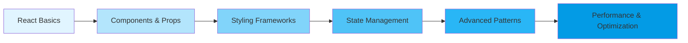

# 🚀 React Learning Journey

<div align="center">


**A comprehensive, hands-on approach to mastering React.js and modern web development**

*From basic components to advanced patterns, state management, and styling frameworks*

</div>

---

## 📚 **Learning Path Overview**

> This repository documents a complete React.js learning journey, covering fundamental concepts to advanced patterns with practical projects and comprehensive documentation.

### 🎯 **What You'll Find Here**

- **📖 Step-by-step learning progression** from React basics to advanced concepts
- **🔧 Hands-on projects** demonstrating real-world applications
- **💻 Multiple styling approaches** including CSS Modules, Bootstrap, and Tailwind CSS
- **⚡ Modern development tools** and best practices
- **🎨 UI/UX implementations** with various design frameworks

---

## 📑 **Chapter By Chapter Breakdown**

<details>
<summary><strong>📦 Chapter 00 - Essential NPM Commands</strong></summary>

**Foundation Setup & Package Management**

- Complete guide to npm commands and project initialization
- Development environment setup
- Dependency management strategies
- Build tools configuration

🔧 **Key Technologies:** NPM, Node.js, Vite, Webpack

</details>

<details>
<summary><strong>🎯 Chapter 01 - React Fundamentals & First Components</strong></summary>

**React Basics & Component Architecture**

- React app initialization with Create React App and Vite
- Understanding JSX syntax and component structure
- Class vs Functional components comparison
- Component composition and basic rendering

🚀 **Projects:**
- Basic React app setup
- First functional and class components
- Component rendering and composition

</details>

<details>
<summary><strong>⚡ Chapter 02 - Dynamic & Reusable Components with Props</strong></summary>

**Component Reusability & Data Flow**

- Understanding React Props system
- Creating dynamic and parameterized components
- Component reusability patterns
- Data flow between parent and child components

🛠️ **Projects:**
- Dynamic student list renderer
- Reusable button components
- Title and content management systems

</details>

<details>
<summary><strong>🎨 Chapter 03 - Bootstrap Integration</strong></summary>

**Responsive Design with Bootstrap**

- Bootstrap 5.3.8 integration in React
- Responsive grid system implementation
- Component styling with Bootstrap classes
- Interactive UI elements

📱 **Projects:**
- **Todo Application** - Full-featured task management app
- Responsive card layouts
- Bootstrap form components

</details>

<details>
<summary><strong>🎭 Chapter 04 - Lucide Icons Implementation</strong></summary>

**Icon Systems & Visual Enhancement**

- Lucide React icon library integration
- Icon customization and theming
- Performance optimization for icon usage
- Custom icon implementations

✨ **Features:**
- Standard and lab icon collections
- Dynamic icon rendering
- Color and size customizations

</details>

<details>
<summary><strong>🎨 Chapter 05 - Tailwind CSS Mastery</strong></summary>

**Utility-First CSS Framework**

- Tailwind CSS setup and configuration
- Utility-first design principles
- Responsive design with Tailwind utilities
- Dark mode implementation

🌟 **Key Concepts:**
- Utility classes and responsive design
- Custom configuration and theming
- Build optimization and purging

</details>

<details>
<summary><strong>📂 Chapter 06 - Git & GitHub Version Control</strong></summary>

**Version Control & Collaboration**

- Comprehensive Git workflow documentation
- GitHub collaboration strategies
- Branching and merging best practices
- Advanced Git commands and concepts

📋 **Documentation Includes:**
- 1100+ lines of detailed Git concepts
- Command references and examples
- Workflow diagrams and explanations
- Best practices and troubleshooting

</details>

<details>
<summary><strong>🧩 Chapter 07 - CSS Modules & Component Composition</strong></summary>

**Modular CSS & Advanced Component Patterns**

- CSS Modules implementation and benefits
- Component children prop patterns
- Event handling in React components
- Map, fragments, and conditional rendering

🔧 **Advanced Topics:**
- CSS scoping and module systems
- Component composition patterns
- Event handling best practices

</details>

<details>
<summary><strong>📊 Chapter 08 - State Management & React Internals</strong></summary>

**React State & Performance Optimization**

- useState hook implementation and patterns
- useRef for DOM manipulation and performance
- React rendering lifecycle understanding
- State management best practices

🧠 **Core Concepts:**
- State vs Refs comparison
- Component re-rendering optimization
- React internals and performance

</details>

<details>
<summary><strong>🌐 Chapter 09 - Context API & Global State</strong></summary>

**Global State Management**

- React Context API implementation
- Theme management systems
- Provider pattern and context consumption
- State sharing across component trees

🎯 **Projects:**
- Theme switcher implementation
- Global state management patterns
- Context provider architectures

</details>

<details>
<summary><strong>🔄 Chapter 10 - useReducer & useEffect Hooks</strong></summary>

**Advanced Hooks & Side Effect Management**

- useReducer for complex state logic
- useEffect for side effects and API calls
- Data fetching and state management
- Performance optimization with hooks

⚡ **Projects:**
- **Counter Application** - Complex state management with useReducer
- **User Card Display** - API integration with useEffect and modern UI design

</details>

---

## 🛠️ **Technologies & Tools Used**

<table>
<tr>
<td valign="top" width="33%">

### **Core Technologies**
- **React 18** - Component-based UI library
- **JavaScript ES6+** - Modern JavaScript features
- **JSX** - JavaScript XML syntax
- **Vite** - Fast build tool and development server

</td>
<td valign="top" width="33%">

### **Styling Frameworks**
- **CSS Modules** - Scoped CSS styling
- **Bootstrap 5.3.8** - Component library
- **Tailwind CSS** - Utility-first CSS framework
- **Custom CSS** - Traditional styling approaches

</td>
<td valign="top" width="33%">

### **Development Tools**
- **NPM** - Package management
- **ESLint** - Code quality and linting
- **Git & GitHub** - Version control
- **VS Code** - Development environment

</td>
</tr>
</table>

---

## 🚀 **Key Features & Projects**

### 🎯 **Featured Applications**

| Project | Chapter | Technologies | Description |
|---------|---------|-------------|-------------|
| **Todo App** | 03 | React, Bootstrap | Complete task management with responsive design |
| **Theme Switcher** | 09 | React, Context API | Global theme management system |
| **Counter App** | 10 | React, useReducer | Complex state management demonstration |
| **User Dashboard** | 10 | React, useEffect, Tailwind | API integration with modern UI |

### 🔧 **Learning Outcomes**

- ✅ **Component Architecture** - Building reusable and maintainable components
- ✅ **State Management** - From basic useState to complex useReducer patterns
- ✅ **Styling Mastery** - Multiple CSS approaches and modern frameworks
- ✅ **API Integration** - Data fetching and side effect management
- ✅ **Performance Optimization** - React best practices and optimization techniques
- ✅ **Modern Tooling** - Development environment and build tool proficiency

---

## 📁 **Project Structure**

```
Learning-React-Bootstrap-TailwindCSS-Git-And-Github/
├── 📚 Chapter_00_All_Important_npm_Cmds/
├── 🎯 Chapter_01_Introduction_to_React_and_First_Component/
├── ⚡ Chapter_02_Dynamic_Reusable_Paramaterised_Components_and_Props/
├── 🎨 Chapter_03_Learning_Bootstrap/
│   ├── To_Do_App/                 # Featured Bootstrap Todo Application
│   └── Using_bootstrap/
├── 🎭 Chapter_04_Learning_Lucide_Icons/
├── 🌟 Chapter_05_Learning_Tailwind_Css/
├── 📂 Chapter_06_Learning_Git_and_GitHub/
├── 🧩 Chapter_07_CSS_Modules_Passing_Children/
├── 📊 Chapter_08_useState_useRef_react_internals/
├── 🌐 Chapter_09_ContextAPI/
└── 🔄 Chapter_10_useReducer_useEffect/
    ├── useEffect/                 # User Dashboard with API integration
    └── useReducer/               # Advanced Counter Application
```

---

## 🌟 **Getting Started**

### **Prerequisites**
- Node.js (v14 or higher)
- npm or yarn package manager
- Git for version control
- Code editor (VS Code recommended)

### **Quick Start Guide**

1. **Clone the repository**
   ```bash
   git clone https://github.com/UsaaryanByte07/Learning-React-Bootstrap-TailwindCSS-Git-And-Github.git
   cd Learning-React-Bootstrap-TailwindCSS-Git-And-Github
   ```

2. **Navigate to any chapter**
   ```bash
   cd Chapter_03_Learning_Bootstrap/To_Do_App
   ```

3. **Install dependencies**
   ```bash
   npm install
   ```

4. **Start development server**
   ```bash
   npm run dev
   ```

5. **Open your browser** and visit `http://localhost:5173`

---

## 📈 **Learning Progress**



---

## 💡 **Best Practices Learned**

- **Component Design Patterns** - Reusable and maintainable component architecture
- **State Management** - Choosing between useState, useReducer, and Context API
- **Performance Optimization** - React.memo, useMemo, and useCallback usage
- **Styling Strategies** - CSS Modules, utility-first CSS, and component libraries
- **Code Organization** - Folder structure and separation of concerns
- **Version Control** - Git workflow and collaborative development

---

## 🤝 **Contributing**

This is a personal learning repository, but feedback and suggestions are always welcome!

1. Fork the repository
2. Create a feature branch (`git checkout -b feature/amazing-feature`)
3. Commit your changes (`git commit -m 'Add some amazing feature'`)
4. Push to the branch (`git push origin feature/amazing-feature`)
5. Open a Pull Request

---

## 📧 **Contact & Connect**

<div align="center">

**Learning is a journey, not a destination. Keep coding! 🚀**

[](https://github.com/UsaaryanByte07)

</div>

---

<div align="center">

**⭐ Star this repository if you found it helpful!**

*Happy React Learning! 🎉*

</div>
